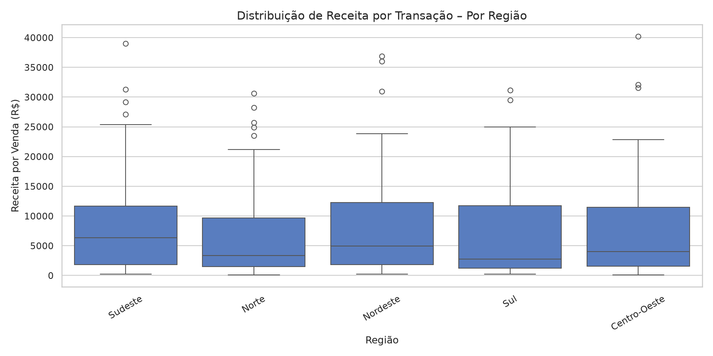
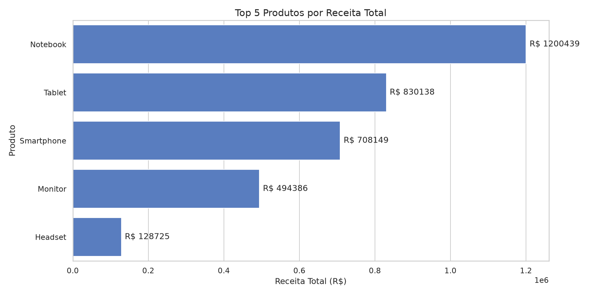
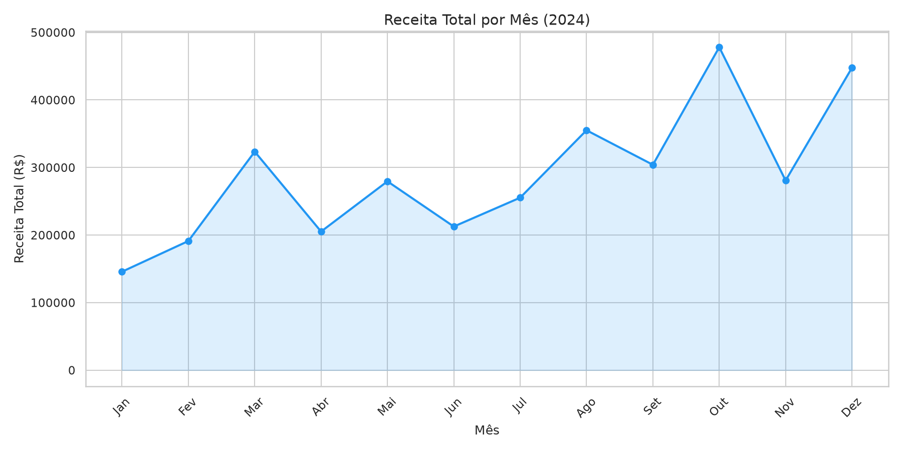
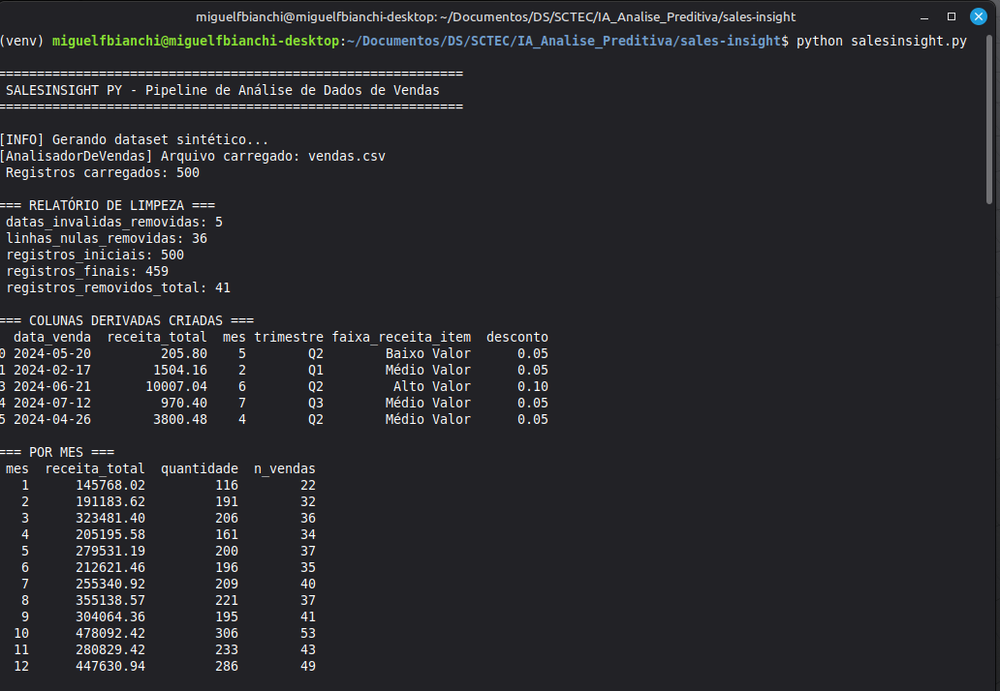
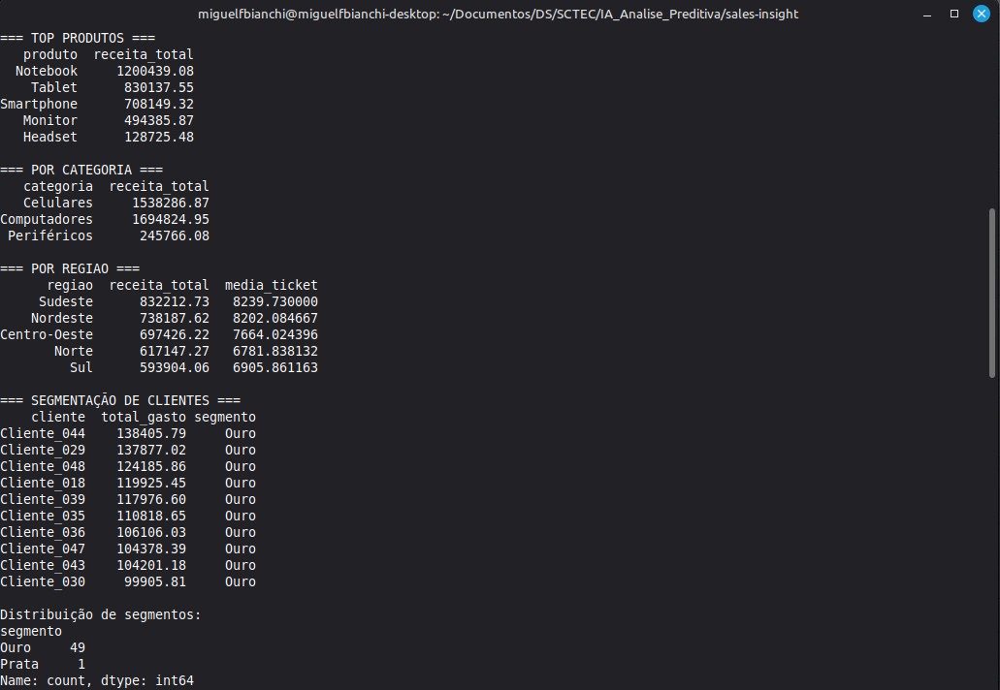
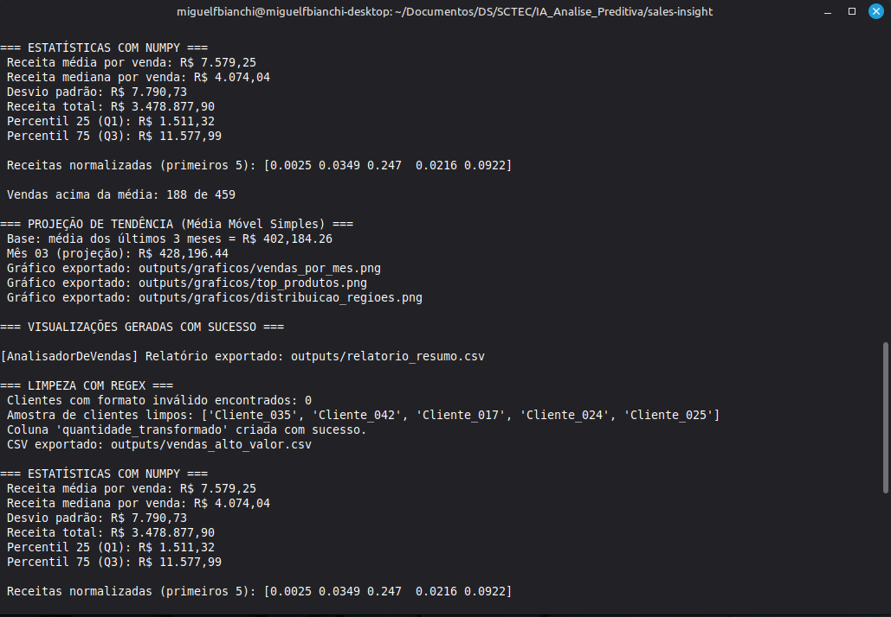
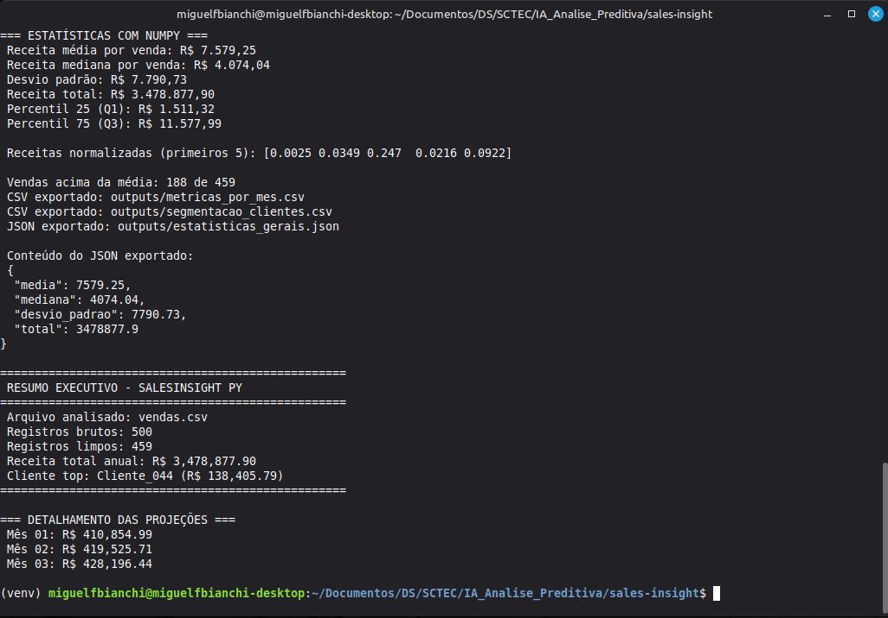

# SalesInsight: Pipeline Automatizado de Analytics e Previsão de Vendas

[](https://python.org)
[](https://pydata.org)
[](https://numpy.org)
[](https://github.com)

O **SalesInsight** é uma solução completa de engenharia e análise de dados (*End-to-End*) desenvolvida para automatizar a ingestão, o tratamento, a modelagem estatística e a visualização de históricos de faturamento corporativo. 

O projeto simula um cenário real de mercado no setor de varejo, onde dados brutos e inconsistentes (em formato CSV) são transformados de forma automatizada em inteligência de negócios para subsidiar tomadas de decisão estratégica da diretoria executiva.

---

## 🎯 OBJETIVO

O objetivo principal deste projeto foi desenvolver e implantar um pipeline robusto, escalável e reutilizável baseado em **Programação Orientada a Objetos (POO)** para responder a cinco perguntas críticas de negócio para o comitê diretivo:

1. **Análise Temporal:** Compreender a flutuação do volume de vendas e receita agrupados por janelas mensais e trimestrais.
2. **Mix de Produtos:** Identificar o Pareto de categorias e produtos que sustentam o faturamento da empresa.
3. **Distribuição Geográfica:** Mapear as regiões de maior performance e oportunidades de expansão de mercado.
4. **Segmentação de Clientes (LTV):** Categorizar a base de clientes pelo nível de consumo/gasto (Bronze, Prata e Ouro) para direcionamento de campanhas de marketing.
5. **Análise Preditiva:** Projetar tendências simples de receita para o próximo período com base no comportamento histórico.

---

## 🛠️ TECNOLOGIAS E ARQUITETURA

O sistema foi modularizado utilizando as melhores práticas de desenvolvimento de software e ciência de dados:

* **Linguagem Core:** Python 3.10+ (estruturado sob os pilares de encapsulamento e herança em POO).
* **Engenharia e Manipulação de Dados:** `Pandas` (DataFrames, agrupamentos e junções lógicas) e `NumPy` (vetorização matemática e broadcasting estatístico).
* **Sanitização de Dados:** Expressões Regulares (`re`) e `datetime` para validação de padrões de strings e normalização de séries temporais.
* **Data Visualization & Storytelling:** `Matplotlib` e `Seaborn` para concepção de gráficos gerenciais customizados de alta densidade informativa.
* **Formatos de Ingestão/Saída:** Manipulação de arquivos estruturados e semiestruturados (`CSV` e `JSON`).
* **Metodologia de Desenvolvimento:** Versionamento distribuído com **Git** e histórico de commits semânticos no **GitHub**.

---

## 📊 RESULTADOS E ENTREGÁVEIS

Como resultado do pipeline executável (`salesinsight.py`), o sistema gera e exporta de forma totalmente autônoma:

* **Data Cleaning Automatizado:** Ingestão de dados brutos com tratamento imediato de valores nulos, remoção de caracteres de escape e correção de formatação cronológica.
* **Relatório Gerencial Estruturado:** Exportação automatizada das métricas agregadas de faturamento e classificação de clientes nos formatos `CSV` e `JSON`.
* **Painel Gráfico Executivo:** Geração automática de arquivo `PNG` contendo a análise visual histórica e a curva preditiva de receita para o próximo trimestre.
* **Governança de Código:** Repositório público com código limpo, modular, documentado e aderente às boas práticas do mercado de tecnologia.

> 🌐 **Demonstração em Vídeo:** [link ]

---

## 🧠 APRENDIZADOS E EVOLUÇÃO TÉCNICA

O desenvolvimento deste pipeline consolidou competências essenciais do ecossistema de Inteligência Artificial e Análise Preditiva promovido pelo **SENAI/SC (Programa SCTEC / LAB365)**. Os principais marcos de evolução técnica envolveram:

* **Arquitetura Baseada em Classes:** Transição do modelo de scripts lineares para estruturas reutilizáveis de software, utilizando construtores, herança e métodos estáticos.
* **Eficiência Computacional:** Substituição de laços de repetição tradicionais (`for`/`while`) por operações vetorizadas do NumPy, reduzindo o custo computacional no processamento de grandes matrizes.
* **Tratamento Avançado de Strings:** Emprego de expressões regulares para sanitizar e padronizar cadastros volumosos com entradas ruidosas.
* **Analytics Traduzido para Negócios:** O aprendizado de que o código serve para automatizar o processo, mas o valor real está em gerar insights claros (*storytelling com dados*) que mudam o rumo de uma empresa.

---

## 🚀 COMO EXECUTAR O PIPELINE

### Opção 1: Nuvem (Google Colab)
1. Faça o upload dos arquivos `salesinsight.py` (ou execute via arquivo `.ipynb`) e o seu dataset `vendas.csv` no ambiente do Colab.
2. Inicialize o pipeline executando a célula com o comando:
   ```bash
   !python salesinsight.py
   ```

### Opção 2: Local (Ambiente de Desenvolvimento)
1. Certifique-se de possuir o Python 3.10+ instalado.
2. Clone este repositório e instale as dependências de engenharia de dados via terminal:
   ```bash
   pip install pandas numpy matplotlib seaborn
   ```
3. Execute o ponto de entrada principal do software:
   ```bash
   python salesinsight.py
   ```

<p align="center">
  
</p>

<p align="center">
  
</p>

<p align="center">
  
</p>

<p align="center">
  
</p>

<p align="center">
  
</p>

<p align="center">
  
</p>

<p align="center">
  
</p>